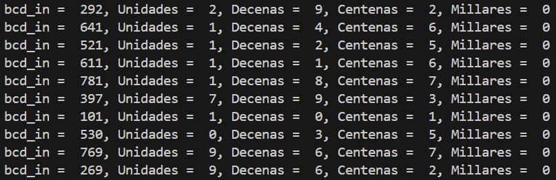
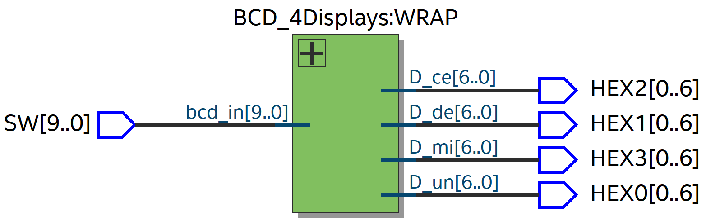

# Práctica 2: BCD

## Wrapper para FPGA: BCD_4Displays_W.v

Este módulo conecta las entradas de los switches de la FPGA con los displays de 7 segmentos.

```verilog
module BCD_4Displays_W (

    input  [9:0] SW,
    output [6:0] HEX0, HEX1, HEX2, HEX3
    
);

    BCD_4Displays WRAP (
        .bcd_in(SW), 
        .D_un(HEX0), 
        .D_de(HEX1), 
        .D_ce(HEX2), 
        .D_mi(HEX3)
    );

endmodule
```

---

## Módulo de conversión: BCD_Module.v

Este módulo convierte un dígito BCD (0–9) a su representación en display de 7 segmentos.

```verilog
module BCD_module (

    input  [3:0] bcd_in,
    output reg [6:0] bcd_out

);

    always @(*) 
    begin
        case (bcd_in)
            4'b0000: bcd_out = ~7'b1111110;
            4'b0001: bcd_out = ~7'b0110000;
            4'b0010: bcd_out = ~7'b1101101;
            4'b0011: bcd_out = ~7'b1111001;
            4'b0100: bcd_out = ~7'b0110011;
            4'b0101: bcd_out = ~7'b1011011;
            4'b0110: bcd_out = ~7'b1011111;
            4'b0111: bcd_out = ~7'b1110000;
            4'b1000: bcd_out = ~7'b1111111;
            4'b1001: bcd_out = ~7'b1111011;
            default: bcd_out = ~7'b0000000;
        endcase
    end

endmodule
```

### Testbench del módulo


---

## Código del testbench: BCD_Module_tb.v

El testbench verifica el funcionamiento del módulo generando valores aleatorios de entrada.

```verilog
module BCD_module_tb();

    reg [3:0] bcd_in;
    wire [6:0] bcd_out;

    BCD_module dut(
        .bcd_in(bcd_in), 
        .bcd_out(bcd_out)
    );

    initial 
    begin
        repeat (32)
        begin
            bcd_in = $random % 16; #10;
        end
        $finish;
    end

    initial 
    begin
        $monitor("bcd_in = %b, bcd_out = %b", bcd_in, bcd_out);
    end

    initial 
    begin
        $dumpfile("BCD_module_tb.vcd");
        $dumpvars(0, BCD_module_tb);
    end

endmodule
```

---

## BCD_4Displays.v

El módulo principal recibe un número binario de 10 bits y lo separa en unidades, decenas, centenas y millares.  
Cada dígito es convertido a su representación para display de 7 segmentos mediante el módulo `BCD_module`.

```verilog
module BCD_4Displays #(parameter N_in = 10, N_out = 7) (

    input [N_in - 1:0] bcd_in,
    output [N_out - 1:0] D_un, D_de, D_ce, D_mi,
    output [3:0] unidades, decenas, centenas, millares
    
);

    assign unidades  = bcd_in % 10;
    assign decenas   = (bcd_in / 10) % 10;
    assign centenas  = (bcd_in / 100) % 10;
    assign millares  = (bcd_in / 1000) % 10;

    BCD_module Unidades (
        .bcd_in(unidades), 
        .bcd_out(D_un)
    );

    BCD_module Decenas (
        .bcd_in(decenas), 
        .bcd_out(D_de)
    );

    BCD_module Centenas (
        .bcd_in(centenas), 
        .bcd_out(D_ce)
    );

    BCD_module Millares (
        .bcd_in(millares), 
        .bcd_out(D_mi)
    );

endmodule
```

---

## Código del testbench: BCD_4Displays_tb.v

El testbench genera valores aleatorios entre 0 y 1023 para verificar la correcta separación de los dígitos y su conversión.

```verilog
module BCD_4Displays_tb();

    reg  [9:0] bcd_in;
    wire [6:0] D_un, D_de, D_ce, D_mi;
    wire [3:0] unidades, decenas, centenas, millares;

    BCD_4Displays dut(
        .bcd_in(bcd_in), 
        .D_un(D_un), 
        .D_de(D_de), 
        .D_ce(D_ce), 
        .D_mi(D_mi), 
        .unidades(unidades), 
        .decenas(decenas), 
        .centenas(centenas), 
        .millares(millares)
    );

    initial 
    begin
        repeat (10)
        begin
            bcd_in = $random % 1024; #10;
        end
        $finish;
    end

    initial 
    begin
        $monitor("bcd_in = %d, Unidades = %d, Decenas = %d, Centenas = %d, Millares = %d",
                  bcd_in, unidades, decenas, centenas, millares);
    end

    initial 
    begin
        $dumpfile("BCD_4Displays_tb.vcd");
        $dumpvars(0, BCD_4Displays_tb);
    end

endmodule
```

### Testbench del sistema



---

## Simulación del Wrapper


---

## RTL



---

## Prueba en FPGA / Demostración

Video del funcionamiento del sistema en la tarjeta FPGA.

[Ver demostración](BCD_4Displays.mp4)
