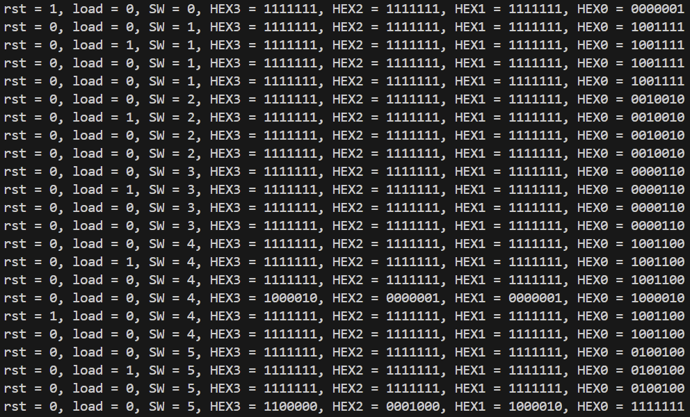

# Práctica 4: Sistema de Password con Máquina de Estados

## BCD_module.v

Este módulo convierte un dígito BCD (0–9) a su representación en display de 7 segmentos.

```verilog
module BCD_module (

	input  [3:0] bcd_in,
	output reg [6:0] bcd_out

);

	always @(*) 
		begin
			case (bcd_in)
				4'b0000:bcd_out = ~7'b1111110;
				4'b0001:bcd_out = ~7'b0110000;
				4'b0010:bcd_out = ~7'b1101101;
				4'b0011:bcd_out = ~7'b1111001;
				4'b0100:bcd_out = ~7'b0110011;
				4'b0101:bcd_out = ~7'b1011011;
				4'b0110:bcd_out = ~7'b1011111;
				4'b0111:bcd_out = ~7'b1110000;
				4'b1000:bcd_out = ~7'b1111111;
				4'b1001:bcd_out = ~7'b1111011;
				default:bcd_out = ~7'b0000000;
			endcase
		end
	
endmodule
```

---

## password_wr.v

El módulo wrapper conecta los botones, switches y reloj de la FPGA con el sistema del password.

```verilog
module password_wr (

    input MAX10_CLK1_50,
    input [9:0] SW,
    input [1:0] KEY,

    output [0:6] HEX0,
    output [0:6] HEX1,
    output [0:6] HEX2,
    output [0:6] HEX3

);

    password dut (

        .clk(MAX10_CLK1_50),
        .rst(~KEY[0]),
        .load(~KEY[1]),
        .SW(SW[3:0]),

        .HEX0(HEX0),
        .HEX1(HEX1),
        .HEX2(HEX2),
        .HEX3(HEX3)

    );

endmodule
```

---

## password.v

Este módulo implementa el sistema de contraseña utilizando una **máquina de estados finitos (FSM)**.

```verilog
module password (

    input clk,
    input rst,
    input load,
    input [3:0] SW,

    output reg [6:0] HEX0,
    output reg [6:0] HEX1,
    output reg [6:0] HEX2,
    output reg [6:0] HEX3

);

    parameter [15:0] password = 16'h1234;

    parameter IDLE = 3'd0,
              S1   = 3'd1,
              S2   = 3'd2,
              S3   = 3'd3,
              GOOD = 3'd4,
              BAD  = 3'd5;

    reg [2:0] state, next_state;

    reg load_sync0, load_sync1;
    wire load_pulse;

    wire [6:0] bcd_out;

    BCD_module bcd_inst (
        .bcd_in(SW),
        .bcd_out(bcd_out)
    );

    always @(posedge clk)
		begin
			load_sync0 <= load;
			load_sync1 <= load_sync0;
		end

    assign load_pulse = load_sync0 & ~load_sync1;

    always @(posedge clk or posedge rst)
		begin
			if (rst)
				state <= IDLE;
			else
				state <= next_state;
		end

    always @(*)
		begin
			next_state = state;

			case (state)

				IDLE:
					if (load_pulse)
						if (SW == password[15:12])
							next_state = S1;
						else
							next_state = BAD;

				S1:
					if (load_pulse)
						if (SW == password[11:8])
							next_state = S2;
						else
							next_state = BAD;

				S2:
					if (load_pulse)
						if (SW == password[7:4])
							next_state = S3;
						else
							next_state = BAD;

				S3:
					if (load_pulse)
						if (SW == password[3:0])
							next_state = GOOD;
						else
							next_state = BAD;

				GOOD:
					next_state = GOOD;

				BAD:
					next_state = BAD;

			endcase
		end

    always @(*)
		begin
			HEX0 = 7'b1111111;
			HEX1 = 7'b1111111;
			HEX2 = 7'b1111111;
			HEX3 = 7'b1111111;

			case (state)

				IDLE, S1, S2, S3:
					HEX0 = bcd_out;

				GOOD:
				begin
					HEX3 = ~7'b0111101; // G
					HEX2 = ~7'b1111110; // O
					HEX1 = ~7'b1111110; // O
					HEX0 = ~7'b0111101; // d
				end

				BAD:
				begin
					HEX3 = ~7'b0011111; // b
					HEX2 = ~7'b1110111; // A
					HEX1 = ~7'b0111101; // D
					HEX0 = 7'b1111111;  // Display apagado
				end

			endcase
		end

endmodule
```

---

## password_tb.v

El testbench verifica el funcionamiento del sistema probando una contraseña correcta e incorrecta.

```verilog
module password_tb();

    reg clk;
    reg rst;
    reg load;
    reg [3:0] SW;

    wire [6:0] HEX0;
    wire [6:0] HEX1;
    wire [6:0] HEX2;
    wire [6:0] HEX3;

    password dut(
        .clk(clk),
        .rst(rst),
        .load(load),
        .SW(SW),
        .HEX0(HEX0),
        .HEX1(HEX1),
        .HEX2(HEX2),
        .HEX3(HEX3)
    );

    initial 
        begin
            clk = 0;
            forever #10 clk = ~clk;
        end

    initial 
        begin
            rst = 1; 
            load = 0; 
            SW = 0; 
            #20;

            rst = 0;

            // Contraseña correcta: 1-2-3-4
            SW = 4'h1; #20;
            load = 1; #20;
            load = 0; #20;

            SW = 4'h2; #20;
            load = 1; #20;
            load = 0; #20;

            SW = 4'h3; #20;
            load = 1; #20;
            load = 0; #20;

            SW = 4'h4; #20;
            load = 1; #20;
            load = 0; #40;

            // Reset
            rst = 1; #20;
            rst = 0; #20;

            // Contraseña incorrecta
            SW = 4'h5; #20;
            load = 1; #20;
            load = 0; #40;

            $stop;
            $finish;
        end

    initial 
        begin
            $monitor("rst = %b, load = %b, SW = %h, HEX3 = %b, HEX2 = %b, HEX1 = %b, HEX0 = %b",
                     rst, load, SW, HEX3, HEX2, HEX1, HEX0);
        end

    initial 
        begin
            $dumpfile("password_tb.vcd");
            $dumpvars(0, password_tb);
        end

endmodule
```

---

## Testbench



---

## Simulación del testbench


---

## RTL


---

## Máquina de Estados (FSM)


---

## Prueba en la tarjeta FPGA

[Ver video de la prueba](Password.mp4)
