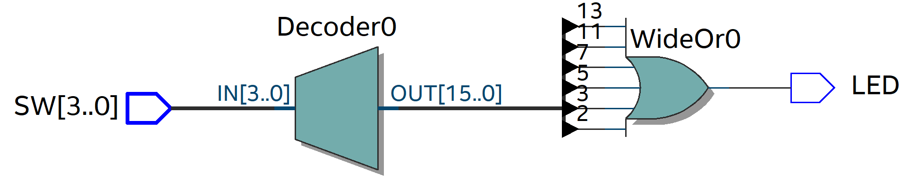

# Práctica 1: Detector de Números Primos

## Num_Primos.v

```verilog
module Num_Primos(

    input [3:0] SW,    // Entrada de 4 bits
    output reg LED);   // Salida tipo "reg" para controlar el LED
    
    always @(*)
    begin
        case (SW)
            4'b0010: LED = 1'b1;  // Estos son los números primos definidos del 2 al 13 y tienen como salida el 1 y se prende el LED
            4'b0011: LED = 1'b1;
            4'b0101: LED = 1'b1;
            4'b0111: LED = 1'b1;
            4'b1011: LED = 1'b1;
            4'b1101: LED = 1'b1;
            default: LED = 1'b0;  // El default es para que los números sin definir tengan como salida el 0 y se apague el LED
        endcase
    end
endmodule
```

---

## Código del testbench: Num_Primos_tb.v

```verilog
module Num_Primos_tb();

    reg [3:0] SW;   // Lo declaro tipo "reg" porque es un input que voy a modificar
    wire LED;       // Lo declaro tipo "wire" porque es la salida del módulo

    Num_Primos dut (.SW(SW), .LED(LED));   // Esta parte es la instanciación de las variables

    initial
    begin
        $display("Simulacion iniciada");
        // Pruebo todos los valores del 0 al 15 con tiempo de simulación de 10 nanosegundos
        SW = 4'b0000; #10;
        SW = 4'b0001; #10;
        SW = 4'b0010; #10;
        SW = 4'b0011; #10;
        SW = 4'b0100; #10;
        SW = 4'b0101; #10;
        SW = 4'b0110; #10;
        SW = 4'b0111; #10;
        SW = 4'b1000; #10;
        SW = 4'b1001; #10;
        SW = 4'b1010; #10;
        SW = 4'b1011; #10;
        SW = 4'b1100; #10;
        SW = 4'b1101; #10;
        SW = 4'b1110; #10;
        SW = 4'b1111; #10;

        $display("Simulacion finalizada");
        $stop;
    end

    initial
    begin
        $monitor("SW = %b, LED = %b", SW, LED);
    end
endmodule
```

---

## Simulación del testbench


---

## RTL



---

## Pruebas con la tarjeta FPGA DE10-Lite

### Pruebas con números primos (LED encendido)

#### Entrada = 2 (0010)
.jpeg)

#### Entrada = 3 (0011)
.jpeg)

En ambos casos el LED se enciende porque los valores de entrada son números primos.

---

### Pruebas con números no primos (LED apagado)

#### Entrada = 6 (0110)
.jpeg)

#### Entrada = 15 (1111)
.jpeg)

En estos casos el LED no se enciende porque los valores de entrada no son números primos.
