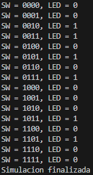
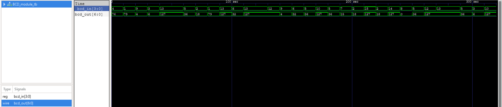
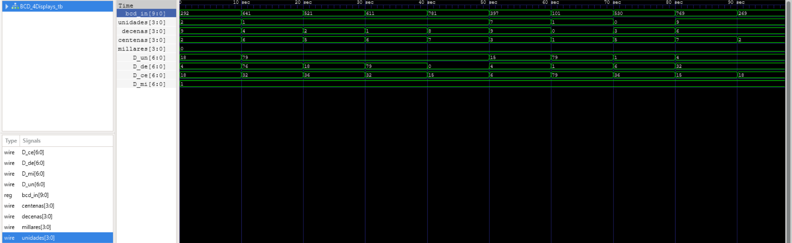

# Práctica 1: Detector de Números Primos

## Num_Primos.v

El módulo recibe el valor de los 4 switches de la FPGA y determina si el número binario corresponde a un número primo.  
Si el número es primo, el LED se enciende; en caso contrario, el LED permanece apagado.

```verilog
module Num_Primos (

	input [3:0] SW,
	output reg LED
	
);
	
	always @(*)
		begin
			case (SW)	
		    	4'b0010:LED = 1'b1;	// Estos son los números primos definidos del 2 al 13 y tienen como salida el 1 y se prende el LED
				4'b0011:LED = 1'b1;
				4'b0101:LED = 1'b1;
				4'b0111:LED = 1'b1;
				4'b1011:LED = 1'b1;
				4'b1101:LED = 1'b1;
				default:LED = 1'b0;	// El default es para que los números sin definir tengan como salida el 0 y se apague el LED
			endcase
		end

endmodule
```

---

## Código del testbench: Num_Primos_tb.v

El testbench genera valores de entrada del 0 al 15 para verificar el funcionamiento del sistema durante la simulación.

```verilog
module Num_Primos_tb();

    reg [3:0] SW;
    wire LED;

    Num_Primos dut(.SW(SW),.LED(LED));

    initial 
        begin
            $display("Simulacion iniciada");

            SW = 4'b0000; #10;
            SW = 4'b0001; #10;
            SW = 4'b0010; #10;
            SW = 4'b0011; #10;
            SW = 4'b0100; #10;
            SW = 4'b0101; #10;
            SW = 4'b0110; #10;
            SW = 4'b0111; #10;
            SW = 4'b1000; #10;
            SW = 4'b1001; #10;
            SW = 4'b1010; #10;
            SW = 4'b1011; #10;
            SW = 4'b1100; #10;
            SW = 4'b1101; #10;
            SW = 4'b1110; #10;
            SW = 4'b1111; #10;

            $display("Simulacion finalizada");
            $finish;
        end

    initial 
        begin
            $monitor("SW = %b, LED = %b", SW, LED);
        end

    initial 
        begin
            $dumpfile("Num_Primos_tb.vcd");
            $dumpvars(0, Num_Primos_tb);
        end

endmodule
```

---

## Testbench



---

## Simulación del testbench


---

## RTL


---

## Pruebas con la tarjeta FPGA DE10-Lite

### Pruebas con números primos (LED encendido)

#### Entrada = 2 (0010)
.jpeg)

#### Entrada = 3 (0011)
.jpeg)

En ambos casos el LED se enciende porque los valores de entrada son números primos.

---

### Pruebas con números no primos (LED apagado)

#### Entrada = 6 (0110)
.jpeg)

#### Entrada = 15 (1111)
.jpeg)

En estos casos el LED no se enciende porque los valores de entrada no son números primos.

---

# Práctica 2: BCD

## BCD_4Displays_W.v

El módulo wrapper conecta las entradas de los switches de la FPGA con el módulo principal `BCD_4Displays` y envía las salidas a los displays de 7 segmentos.

```verilog
module BCD_4Displays_W (

    input  [9:0] SW,
    output [6:0] HEX0, HEX1, HEX2, HEX3
    
);

    BCD_4Displays WRAP (
        .bcd_in(SW), 
        .D_un(HEX0), 
        .D_de(HEX1), 
        .D_ce(HEX2), 
        .D_mi(HEX3)
    );

endmodule
```

---

## BCD_Module.v

Este módulo convierte un dígito BCD (0–9) a su representación en display de 7 segmentos.

```verilog
module BCD_module (

	input  [3:0] bcd_in,
	output reg [6:0] bcd_out

);

	always @(*) 
		begin
			case (bcd_in)
				4'b0000:bcd_out = ~7'b1111110;
				4'b0001:bcd_out = ~7'b0110000;
				4'b0010:bcd_out = ~7'b1101101;
				4'b0011:bcd_out = ~7'b1111001;
				4'b0100:bcd_out = ~7'b0110011;
				4'b0101:bcd_out = ~7'b1011011;
				4'b0110:bcd_out = ~7'b1011111;
				4'b0111:bcd_out = ~7'b1110000;
				4'b1000:bcd_out = ~7'b1111111;
				4'b1001:bcd_out = ~7'b1111011;
				default:bcd_out = ~7'b0000000;
			endcase
		end
	
endmodule
```

---

## BCD_Module_tb.v

El testbench genera valores aleatorios para verificar el funcionamiento del módulo durante la simulación.

```verilog
module BCD_module_tb();

    reg [3:0] bcd_in;
    wire [6:0] bcd_out;

    BCD_module dut(
        .bcd_in(bcd_in), 
        .bcd_out(bcd_out)
    );

    initial 
        begin
            repeat (32) // 32 es el número de iteraciones de las repeticiones
            begin
                bcd_in = $random % 16; #10; // $random es para generar un número aleatorio y el % 16 es para dividir el número entre 16 y nos daría un número menor que 16
            end
                $finish;
        end

    initial 
        begin
            $monitor("bcd_in = %b, bcd_out = %b", bcd_in, bcd_out);
        end

    initial 
        begin
            $dumpfile("BCD_module_tb.vcd");
            $dumpvars(0, BCD_module_tb);
        end

endmodule
```

---

## Testbench


---

## Simulación del testbench



---

## RTL


---

## BCD_4Displays.v

El módulo principal recibe un número binario de 10 bits y lo separa en unidades, decenas, centenas y millares.  
Cada dígito es convertido a su representación para display de 7 segmentos mediante el módulo `BCD_module`.

```verilog
module BCD_4Displays #(parameter N_in = 10, N_out = 7) (

    input [N_in - 1:0] bcd_in,
    output [N_out - 1:0] D_un, D_de, D_ce, D_mi,
    output [3:0] unidades, decenas, centenas, millares
    
);

    assign unidades = bcd_in % 10;
    assign decenas = (bcd_in / 10) % 10;
    assign centenas = (bcd_in / 100) % 10;
    assign millares = (bcd_in / 1000) % 10;

    BCD_module Unidades (
        .bcd_in(unidades), 
        .bcd_out(D_un)
    );

    BCD_module Decenas (
        .bcd_in(decenas), 
        .bcd_out(D_de)
    );

    BCD_module Centenas (
        .bcd_in(centenas), 
        .bcd_out(D_ce)
    );

    BCD_module Millares (
        .bcd_in(millares), 
        .bcd_out(D_mi)
    );

endmodule
```

---

## BCD_4Displays_tb.v

El testbench genera valores entre 0 y 1023 para verificar la correcta separación de los dígitos y su conversión.

```verilog
module BCD_4Displays_tb();

    reg  [9:0] bcd_in;
    wire [6:0] D_un, D_de, D_ce, D_mi;
    wire [3:0] unidades, decenas, centenas, millares;

    BCD_4Displays dut(
        .bcd_in(bcd_in), 
        .D_un(D_un), 
        .D_de(D_de), 
        .D_ce(D_ce), 
        .D_mi(D_mi), 
        .unidades(unidades), 
        .decenas(decenas), 
        .centenas(centenas), 
        .millares(millares)
    );

    initial 
        begin
            repeat (10)
            begin
                bcd_in = $random % 1024; #10;
            end
                $finish;
        end

    initial 
        begin
            $monitor("bcd_in = %d, Unidades = %d, Decenas = %d, Centenas = %d, Millares = %d", bcd_in, unidades, decenas, centenas, millares);
        end

    initial 
        begin
            $dumpfile("BCD_4Displays_tb.vcd");
            $dumpvars(0, BCD_4Displays_tb);
        end
        
endmodule
```

---

## Testbench


---

## Simulación del testbench



---

## RTL


---

## Pruebas con la tarjeta FPGA DE10-Lite

[Ver video de la prueba](Practica_2_BCD/BCD_4Displays.mp4)

---

